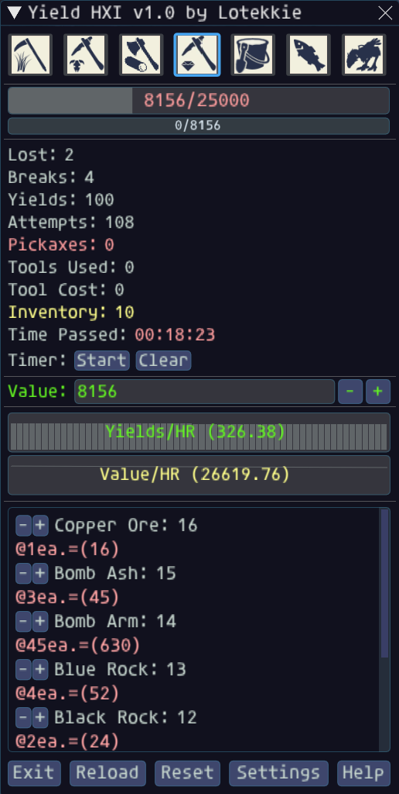
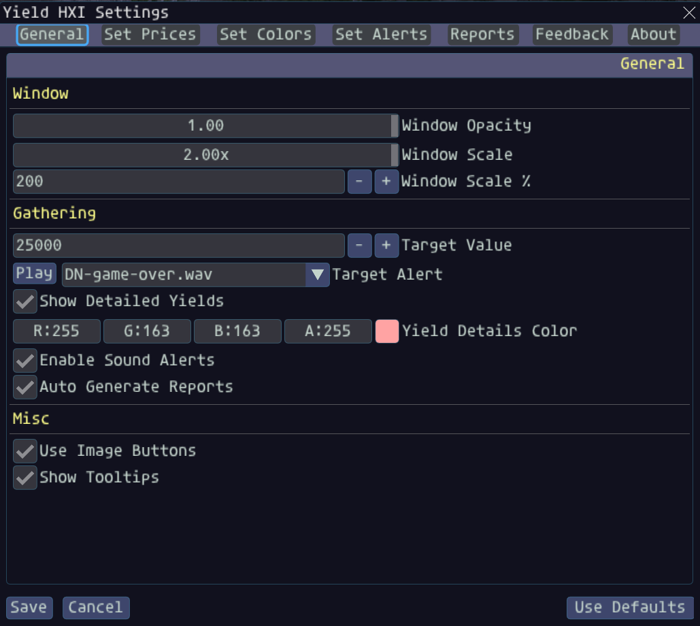
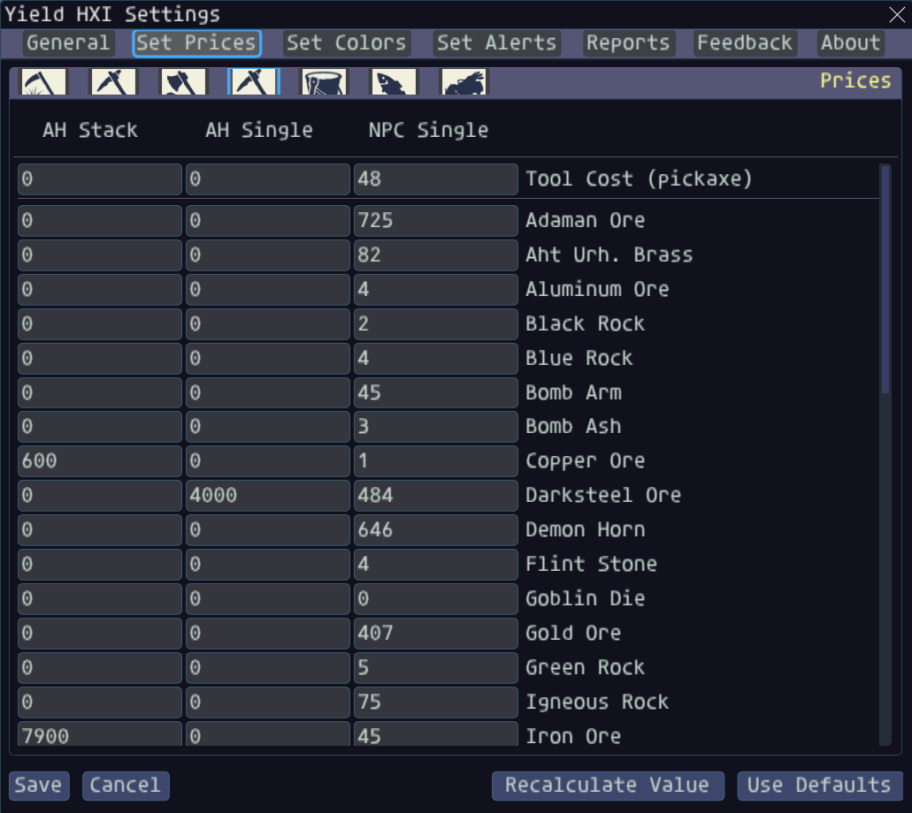
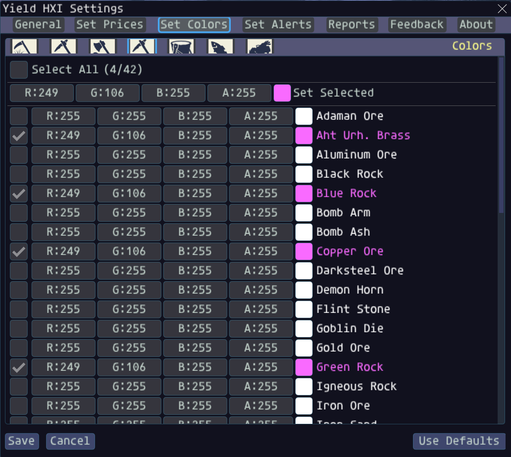
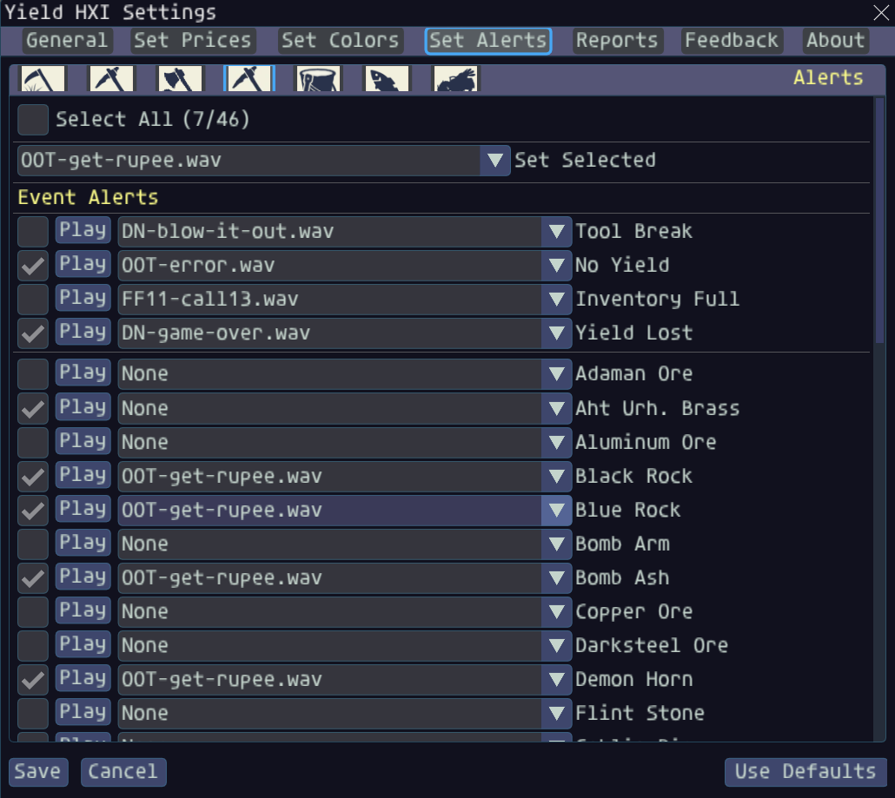
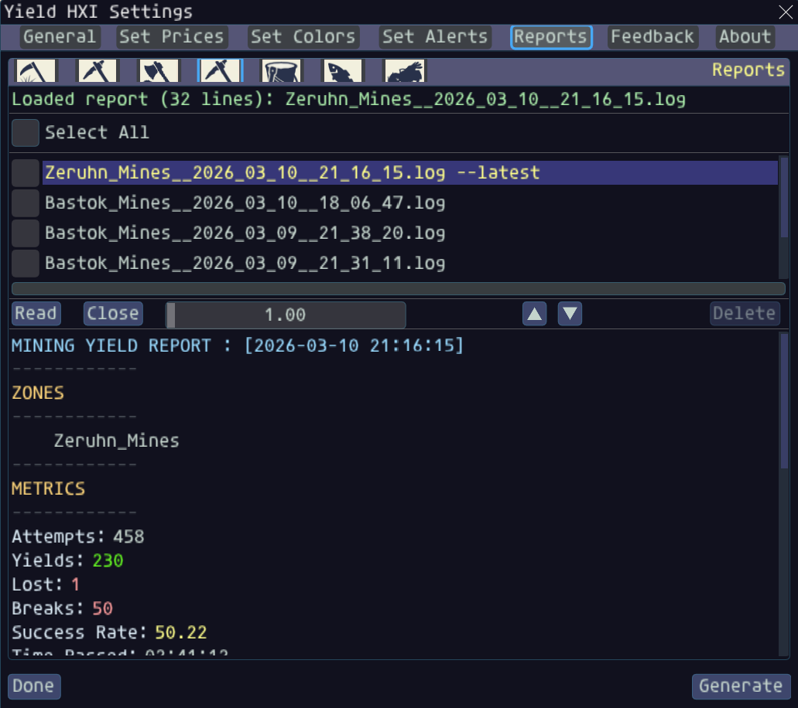

**Author:** [Sjshovan (LoTekkie)](https://github.com/LoTekkie)  
**Version:** v1.0

# Yield HXI

> An Ashita v4 addon for HorizonXI that tracks gathering metrics and provides editable prices, alerts, reports, and in-game settings.

> Legacy project: the original Ashita v3 version of Yield is available at [Sjshovan/Ashita-Yield](https://github.com/Sjshovan/Ashita-Yield).
> This repository is a port of that project specifically for the HorizonXI private server.
> Compatibility with other servers running Ashita v4 is not guaranteed.

  

### Table of Contents

- [Prerequisites](#prerequisites)
- [Installation](#installation)
- [Upgrading](#upgrading)
- [Aliases](#aliases)
- [Usage](#usage)
- [Commands](#commands)
- [Support](#support)
- [Change Log](#change-log)
- [Known Issues](#known-issues)
- [License](#license)

___
### Prerequisites
1. [Final Fantasy XI Online](http://www.playonline.com/ff11us/index.shtml)
2. Ashita v4
3. HorizonXI-compatible addon environment

___
### Installation

1. Place this folder at `addons/yield`.
2. Start Ashita.
3. Load the addon with:

    /addon load yield

**Autoloading**

Add `/addon load yield` to your Ashita startup script if you want the addon loaded automatically.

___
### Upgrading

1. Exit Final Fantasy XI.
2. Replace the existing `addons/yield` folder with the updated version.
3. If the UI or settings behave unexpectedly after a larger update, back up and then clear the addon settings for a clean rebuild.
4. Reload the addon with `/addon reload yield`.

___
### Aliases
The following aliases are available to Yield commands:    

**yield:** yld  
**unload:** u  
**reload:** r  
**find:** f  
**about:** a  
**help:** h  
 
 ___
### Usage

Manually load the addon with:
    
    /addon load yield  

Yield HXI supports harvesting, excavating, logging, mining, digging, fishing, and clamming with configurable pricing, alerts, colors, reports, and settings through the in-game UI.

___    
### Commands

**help**

Displays available Yield commands. Below are the equivalent ways of calling the command:

    /yield help
    /yld help
    /yield h
    /yld h
    
**unload**

Unloads the Yield addon. Below are the equivalent ways of calling the command:
    
    /yield unload
    /yld unload
    /yield u
    /yld u
    
**reload**

Reloads the Yield addon. Below are the equivalent ways of calling the command:
    
    /yield reload
    /yld reload
    /yield r
    /yld r

**find**

Positions the Yield window to the top left corner of your screen. Below are the equivalent ways of calling the command:
    
    /yield find
    /yld find
    /yield f
    /yld f

**about**

Displays information about the Yield addon. Below are the equivalent ways of calling the command:
    
    /yield about
    /yld about
    /yield a
    /yld a
    
___
### Support
**Having Issues with this addon?**
* Please report them here: [https://github.com/Sjshovan/Ashita-Yield-HXI/issues](https://github.com/Sjshovan/Ashita-Yield-HXI/issues).
  
**Have something to say?**
* Send feedback through the in-app Feedback page or email: <Sjshovan@Gmail.com>

**Want to stay in the loop with my work?**
* Repository: <https://github.com/Sjshovan/Ashita-Yield-HXI>
* Discord: <https://discord.gg/jTXqGnNJ8r>

**Want to support development?**
* You can do so here: <https://www.Paypal.me/Sjshovan>

___
### Change Log
**v1.0.0** - 03/23/2026 (HorizonXI Edition)
- Revamped the UI across the main window, settings, help, and reports flows.
- Added a second progress bar for tool cost tracking.
- Added tool cost metrics and supporting settings.
- Updated graph logic and metric presentation.
- Added new metrics and colorized metric displays.
- Added checkbox-based selection controls to Set Colors and Set Alerts.
- Added new alert types.
- Added a draggable read window to Reports.
- Added a Recalculate Value button to Set Prices.
- Added price order priority logic in Set Prices: `AH Stack -> AH Single -> NPC Single`.
- Added tooltips across the app.
- Added the window scaling slider and revamped scaling behavior.
- Synced NPC base pricing defaults from LandSandBoat item data.
- Fixed yield tracking issues across all gathering types.
- Fixed cases where yields were not counted correctly during skill-up or break events.
- Fixed inventory count handling.

___
### Known Issues

- Large game window or UI scale changes may still require a quick position reset with `/yield find`.
- Some behavior still depends on server-specific system messages, so parsing should be verified against the live HorizonXI environment after major server-side changes.

### License

Copyright 2026, [Sjshovan (LoTekkie)](https://github.com/LoTekkie).
Released under the [BSD License](LICENSE).

***
